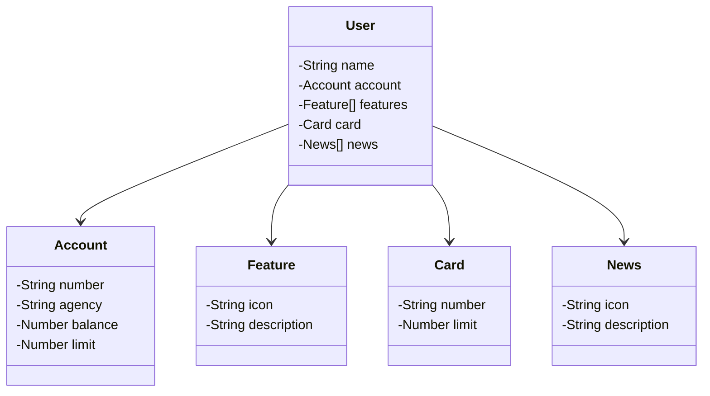

# Santader dev week 2024
Api Java RestFul Santader

## Diagrama de Classe

```mermaid
classDiagram
  class User {
    -String name
    -Account account
    -Feature[] features
    -Card card
    -News[] news
  }

  class Account {
    -String number
    -String agency
    -Number balance
    -Number limit
  }

  class Feature {
    -String icon
    -String description
  }

  class Card {
    -String number
    -Number limit
  }

  class News {
    -String icon
    -String description
  }

  User --> Account
  User --> Feature
  User --> Card
  User --> News
```
